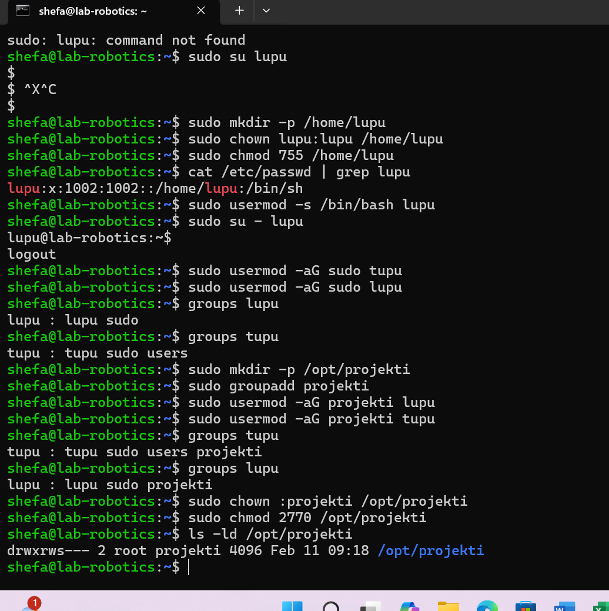

# linux-03
## Linux User Management and File Permissions
This documentation outlines the process of creating users in Linux and managing file access permissions. The Task involves creating different types of users and setting up a shared directory with specific access permissions.
***
### Task 1: Creating User Tupu
The first task involved creating a regular user named "tupu" using the adduser script:
```
sudo adduser tupu
```
This command creates a new user with:
* A home directory
* Default shell settings
* User group
* Prompts for password and user information

### Task 2: Creating User Luput
For the second user, we used the __useradd__ command with specific parameters to create a user profile similar to Tupu:
```
sudo useradd -m -d /home/lupu -s /bin/bash lupu
sudo passwd lupu
```
-m: Creates the user's home directory
-d /home/lupu: Specifies the home directory path
-s /bin/bash: Sets the login shell to bash
passwd lupu: Sets the password for the user


### Task 3: Creating System User Hupu
Created a system user with restricted login capabilities:
```
sudo useradd --system --shell /bin/false hupu
```

--system: Creates a system account
--shell /bin/false: Prevents login access

### Task 4: Adding Users to Sudo Group
add users to sudo group using:
```
sudo usermod -aG sudo tupu
sudo usermod -aG sudo lupu
```
these commands alone did not show the users in the sudoers file. To ensure proper sudo access I had to manually add the users to the sudoers file:
```
sudo visudo
```
added the following lines after "# User privilege specification" and under "root ALL=(ALL:ALL) ALL":
```
tupu    ALL=(ALL:ALL) ALL
lupu    ALL=(ALL:ALL) ALL
```
This manual addition in the sudoers file ensures that both users have the proper sudo privileges.

### Task 5: Setting Up Shared Directory with Specific Permissions
This Task involved creating a shared directory with specific access permissions for Tupu and Lupu users. Here's a detailed breakdown of the process:




The test demonstrates that:

* Tupu can create files
* Lupu can access the directory
* Both users can read and write to the same file
* Files maintain proper group ownership
***
Permission Structure (2770):

2: Sets the SGID (Set Group ID) bit
7: Gives read, write, and execute permissions to the owner (root)
7: Gives read, write, and execute permissions to the group (projekti)
0: No permissions for others
***
The SGID bit (2) is crucial because:

It ensures all new files created in the directory inherit the projekti group ownership
Maintains consistent group permissions for all files and subdirectories
Allows both Tupu and Lupu to collaborate effectively in the directory

The final directory permissions can be verified using:
```
ls -ld /opt/projekti
```
Output shows:
```
drwxrws--- 2 root projekti 4096 Feb  5 09:32 /opt/projekti/
```
__This confirms:__

* Directory is owned by root
* Group ownership is set to projekti
* SGID bit is set (s in the group permissions)
* Only members of projekti group can access the directory